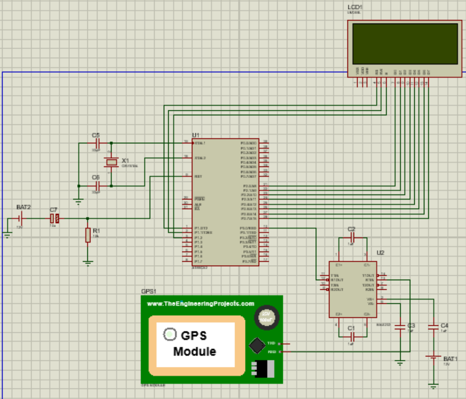

Not many existing systems have been effective in providing traffic data to users, although some have been implemented in countries like Germany, and the US. While Google Traffic provides some traffic data, traffic congestion problems, particularly in Nepal, remain unaddressed. Margadarshan aims to manage traffic by alerting users about different unforeseen conditions such as heavy traffic, constructions, accidents and diverging them to less crowded routes to optimize their travel time. The system also seeks to provide real-time updates on passenger density and the number of available seats inside public vehicles while also tracking their locations. Additionally, it offers users route-specific information, such as fog conditions, temperature, rainfall, dust, and pollution levels. 

Margdarshan is a web based application that collects real-time information of the traffic density through image processing and forwards it to its users. It calculates the time to reach the destination considering the traffic congestion and helps users pick the route that is optimal to reach the location. It also offers information about the temperature, humidity, and weather conditions of the user’s current location. A traffic capacity counting was implemented to count the number of vehicles in a certain region. 

<!-- 

    

 -->

    

        
    

    

        
    

This system further tracks public transport using GPS and also lets the user know about the passenger count in a particular vehicle. The GPS sensor is interfaced in an 8051 microcontroller (AT89C51) to track the location of the vehicle. The data is obtained in the form of latitude and longitude and uploaded to the web and the location is shown in the map. Passenger count system is implemented by using a switch (or an IR sensor) at the entry and exit points of the public. At entry, when an incoming person presses the switch, the passenger count increases and at exit, when an outgoing person presses the exit switch, the passenger count decreases.

    

        
    

    

        
    

    

Furthermore, the system alerts users to potential obstructions caused by construction work, accidents, or riots, helping them avoid time delays and potential dangers. The application has the feature where people can post an update regarding the conditions of their surroundings and share the information to everyone. The validity of the post can be tested by implementing the voting and credit point system.

    

        
    

    

        
    

    

<!--  -->

<!-- 

    

 -->