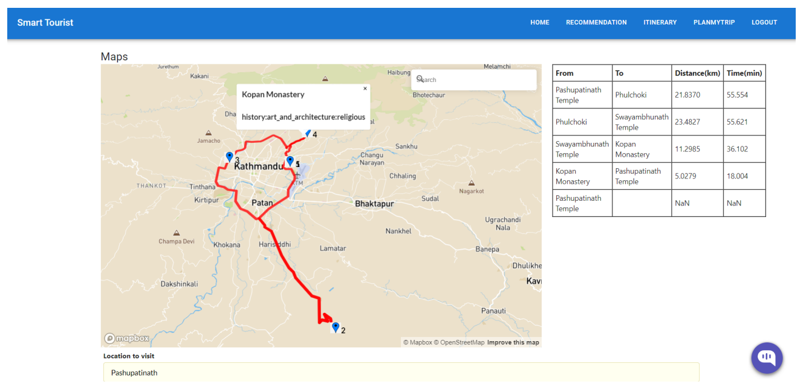
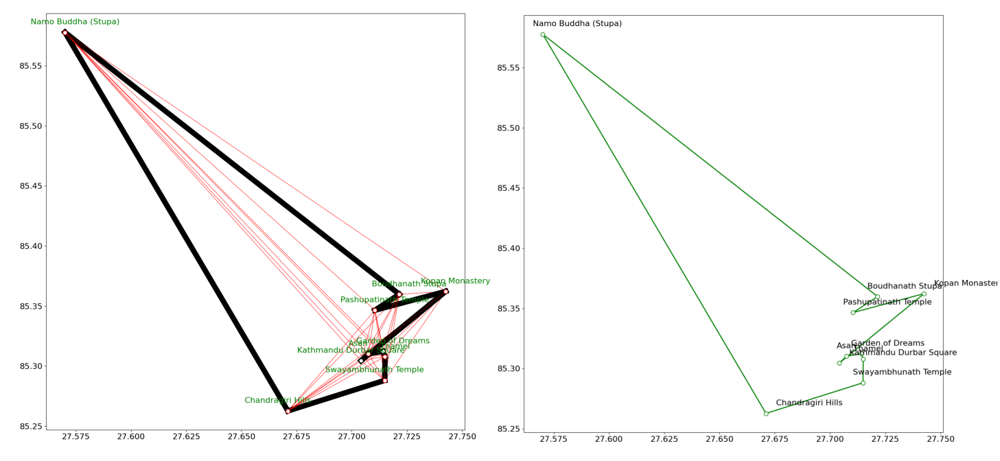
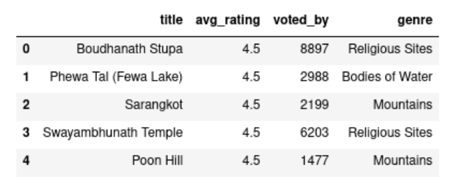
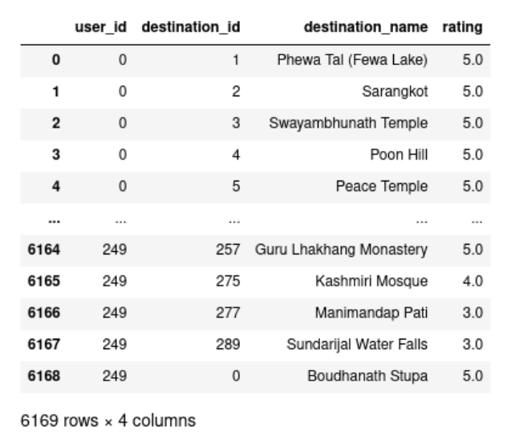
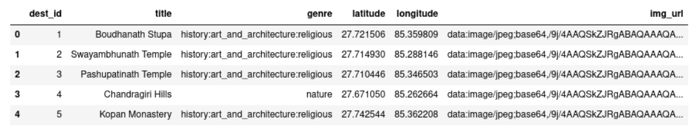
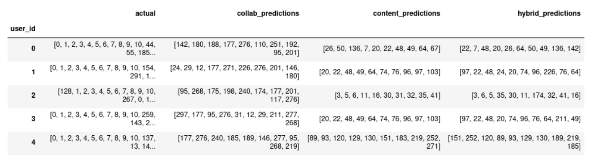
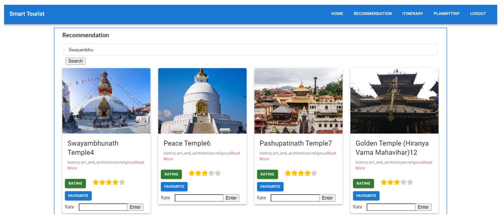
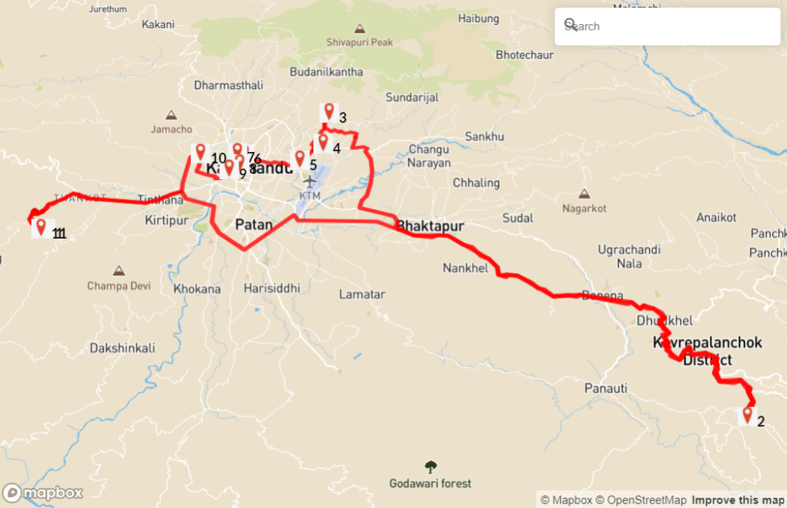
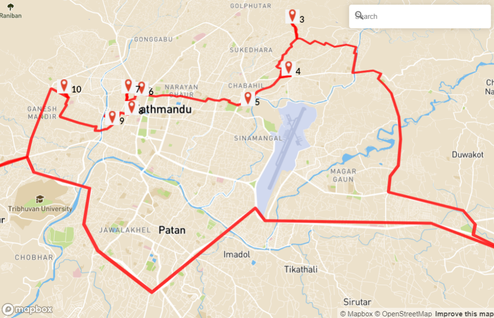
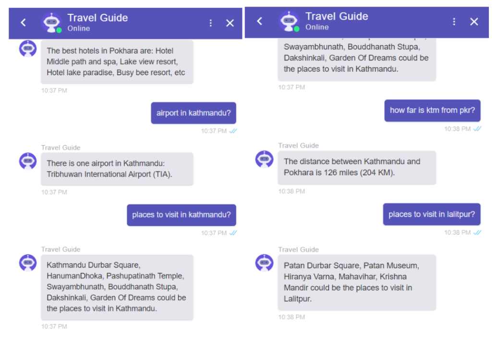

Traveling to new places is a refreshing and fulfilling experience for naturally curious individuals, especially in today's world where leisure often feels like a luxury. However, the uncertainty before embarking on a trip is common, as there are usually countless options to consider. Balancing personal preferences and constraints only adds to the challenge. The Optimized Itinerary Recommender, targeted specifically for tourists visiting new places, is designed to generate the best possible itinerary for travelers, tailored to their preferences and previous ratings. By factoring in constraints such as time, budget, and distance, the problem essentially transforms into an "orienteering problem," a variant of the well-known NP-hard Travelling Salesman Problem (TSP). It aims to plan the most efficient itineraries by linking together the best places to visit that are nearby.

    

For the optimized itinerary, Ant Colony Optimization technique is used. ACO is a probabilistic metaheuristic technique for solving difficult combinatorial optimization problems. It is an algorithm which is used to find the optimal path in a graph. It is inspired by the behavior of ants in finding paths from the colony to food. It falls under Swarm Intelligence, which is a branch inside the large domain of Artificial Intelligence (AI). In the ACO algorithm, a set of software agents called artificial ants are created and used to solve the given optimization problem. The optimization problem is transformed into the problem of finding the best path on a weighted graph.

    

Datasets were scraped from Tripadvisor using Python libraries like: beautiful soup, selenium, and requests, and users rated different destinations.

    

        
    

    

        
    

    

Content-based recommendation, collaborative filtering using KNN, and hybrid recommendation methods were implemented to provide users with personalized suggestions for similar top destinations.

    

    

Once a list of places similar to the searched location is generated, the Ant Colony Optimization technique is used for optimized itinerary recommendations. This method was chosen as it outperforms other route optimization algorithms, such as dynamic programming and greedy search.

    

        
    

    

        
    

Chatbot is also integrated in the website to assist users with simple queries related to the places they are visiting. 

    

